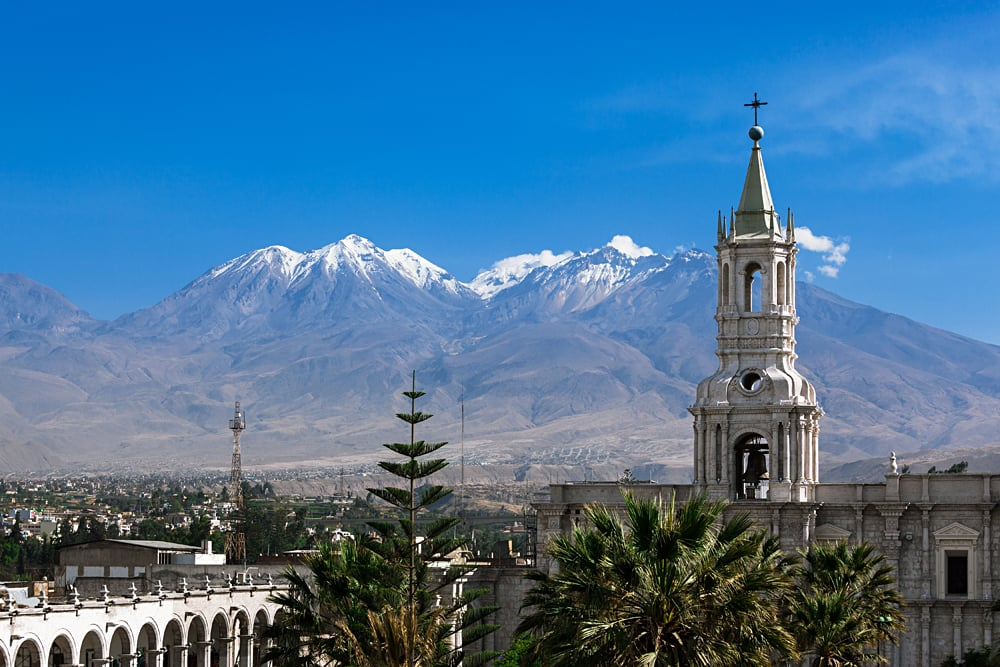

[[Back to the list]](city_list.md)
# Arequipa
**Overview:** Arequipa  is a city in Peru and the capital of the eponymous province and department. It is the seat of the Constitutional Court of Peru and often dubbed the "legal capital of Peru". It is the second most populated city in Peru, after Lima, with an urban population of 1,296,278 inhabitants according to the 2017 national census.

## Trips and landscape
**Day trips:** take a look at the best day trips from the city [here](https://www.alongdustyroads.com/posts/arequipa-tours-day-trips).
|  |  |
| - | - |
|  |  |
