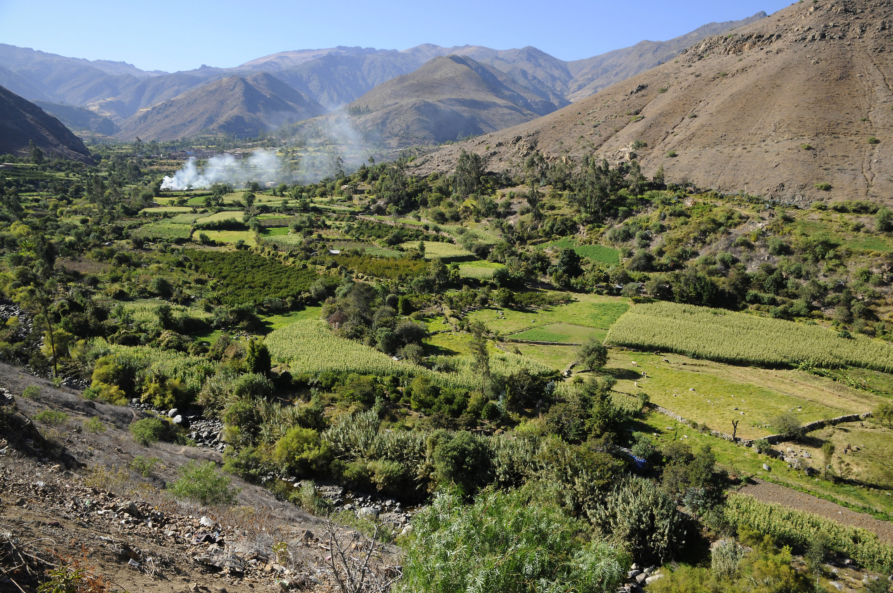
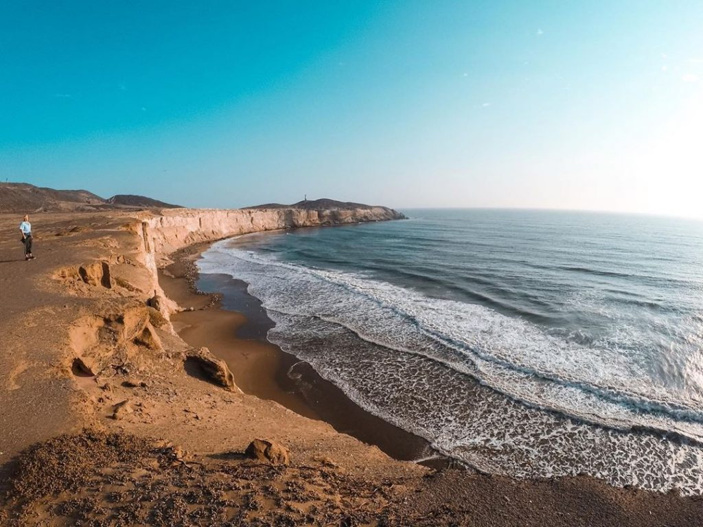
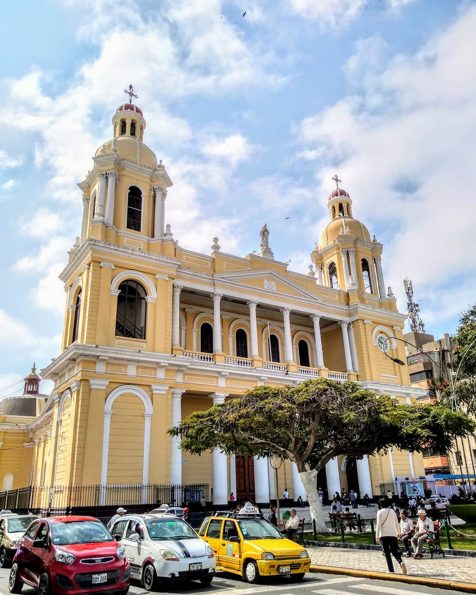
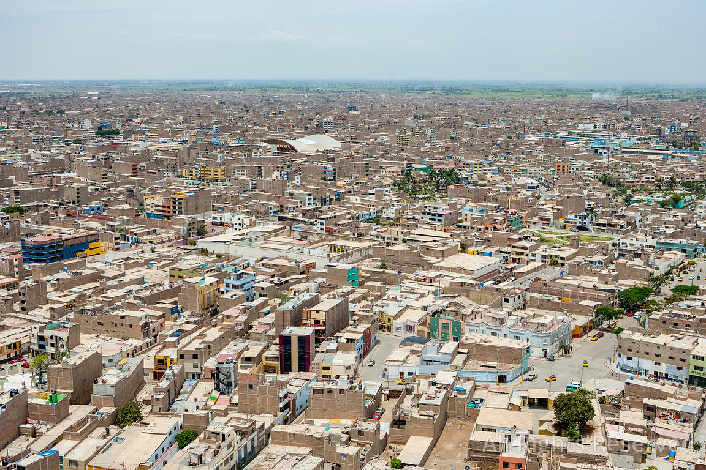

[[Back to the list]](city_list.md)
# Chiclayo
**Overview:** Chiclayo  is the principal city of the Lambayeque region in northern Peru. It is located 13 km  inland from the Pacific coast and 770 km  from the nation's capital, Lima.

## Trips and landscape
**Day trips:** take a look at the best day trips from the city [here](https://www.viator.com/Chiclayo-tours/Day-Trips-and-Excursions/d5464-g5).

|  |  |
| --- | --- |
|  |  |
|  |  |
