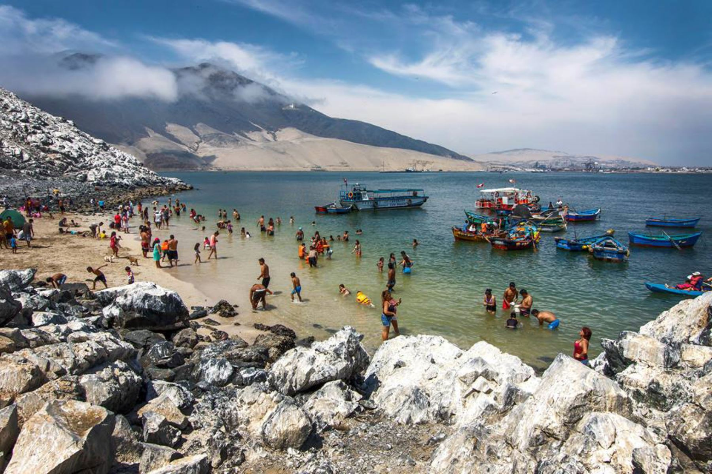
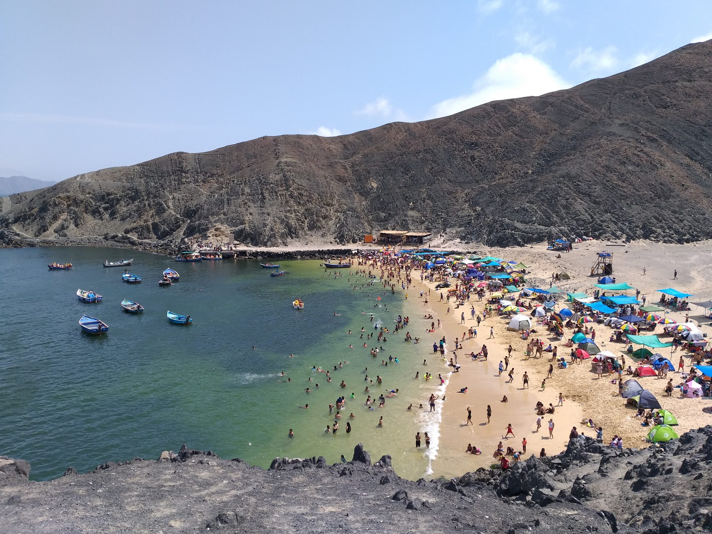
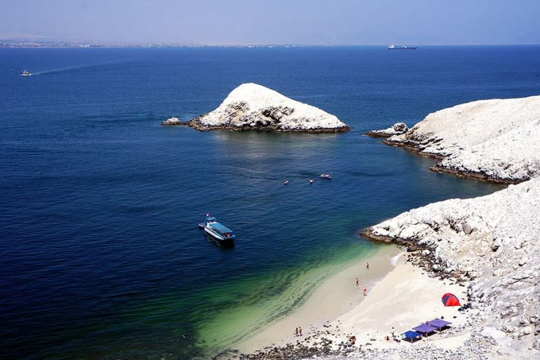
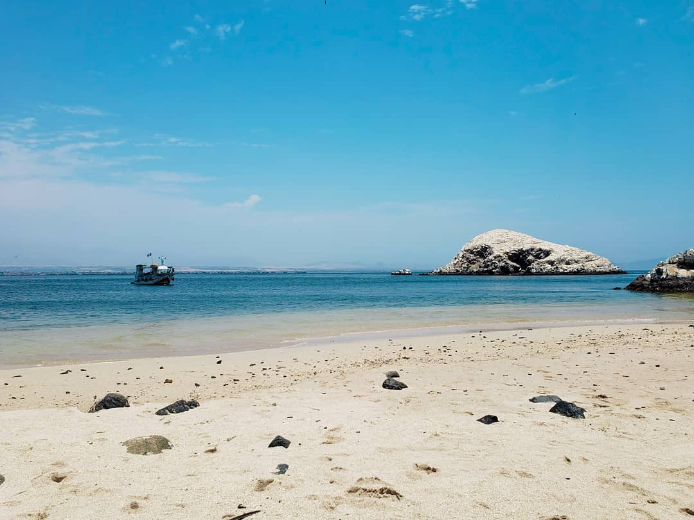

[[Back to the list]](city_list.md)
# Chimbote
**Overview:** Chimbote  ⓘ; Quechua: Chimputi) is the largest city in the Ancash Region of Peru, and the capital of both Santa Province and Chimbote District.

## Trips and landscape
**Day trips:** take a look at the best day trips from the city [here](https://www.tripadvisor.com/Attractions-g1597002-Activities-Chimbote_Ancash_Region.html).
:---:|:---:
  |  
:---:|:---:
  |  
