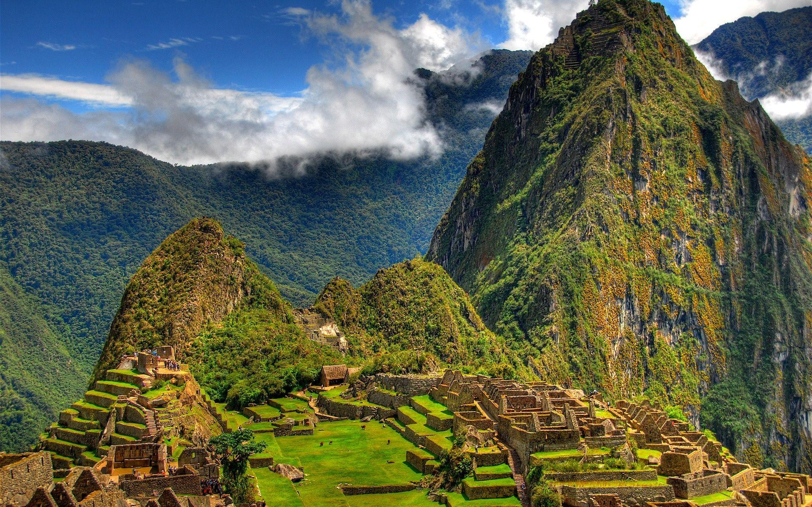
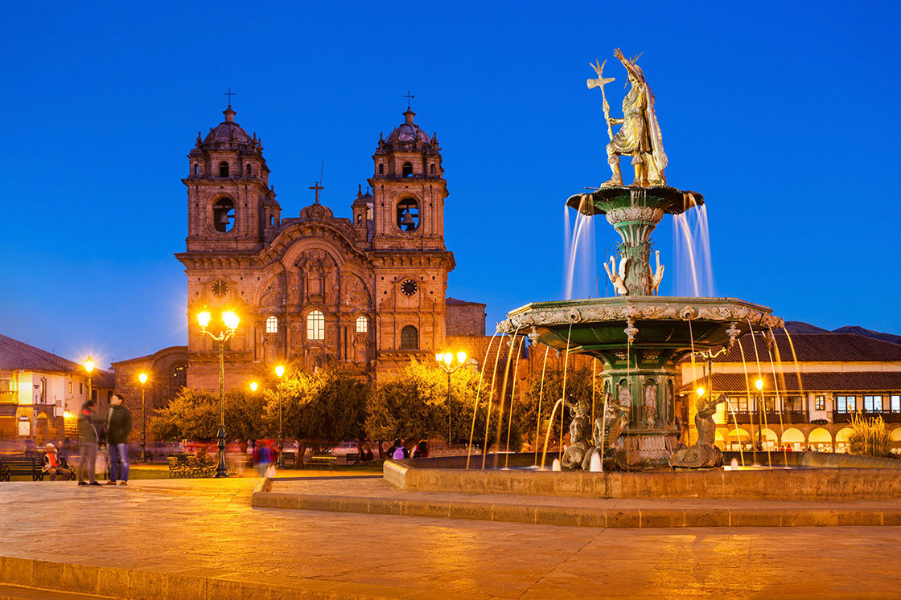

[[Back to the list]](city_list.md)
# Cusco
**Overview:** Cusco or Cuzco  is a city in southeastern Peru near the Urubamba Valley of the Andes mountain range. It is the capital of the Cusco Region and of the Cusco Province. The city is the seventh most populous in Peru; in 2017, it had a population of 428,450. Its elevation is around 3,400 m .

## Trips and landscape
**Day trips:** take a look at the best day trips from the city [here](https://www.alongdustyroads.com/posts/best-day-trips-from-cusco).
|  |  |
| --- | --- |
|  |  |
|  |  |
