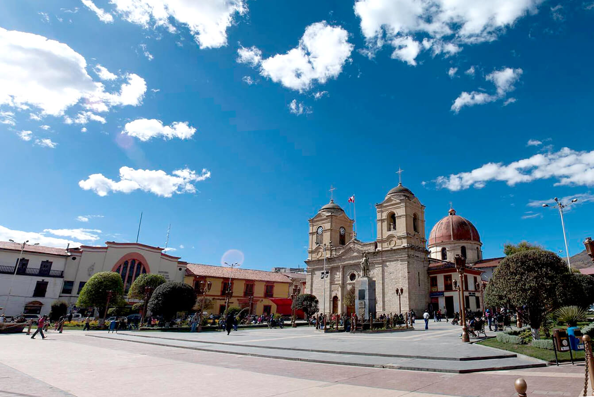

[[Back to the list]](city_list.md)
# Huancayo
**Overview:** Huancayo is located in the Huancayo Province, serving as the province's capital. Situated in the Mantaro Valley at an altitude of 3,271 meters, it belongs to the Quechua region. Depending on delimitation, the agglomeration has a population between 340,000 and 380,000 and is the fifth most populous city of the country. Huancayo is the cultural and commercial center of the whole central Peruvian Andes area. Huancayo Metropolitano is made up of seven districts that form the urban center of the Junín region. This region is considered central Peru's economic and social hub.

## Trips and landscape
**Day trips:** take a look at the best day trips from the city [here](https://www.tripadvisor.com/Attractions-g616333-Activities-Huancayo_Junin_Region.html).
|  |  |
| --- | --- |
|  |  |
|  |  |
