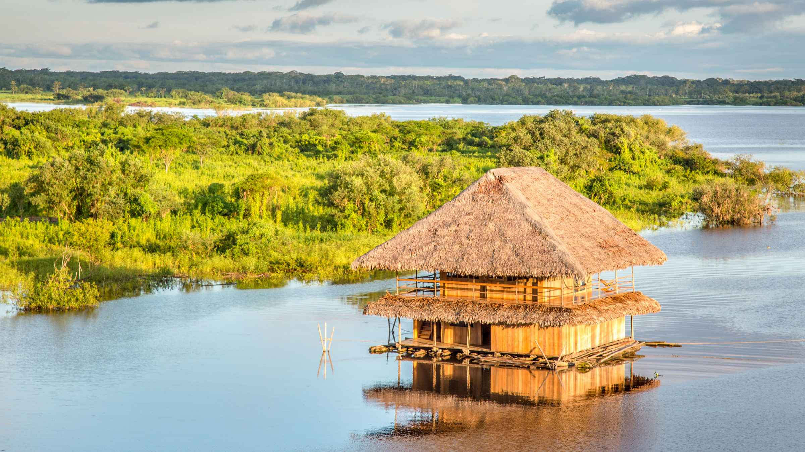
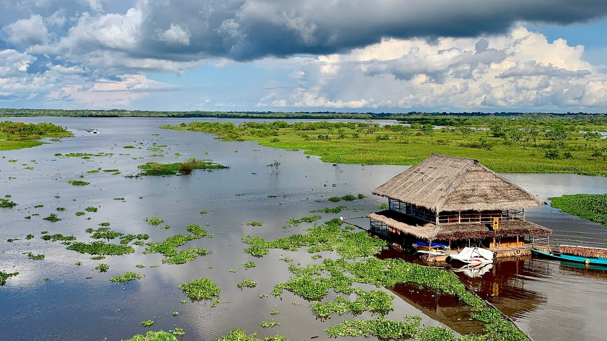
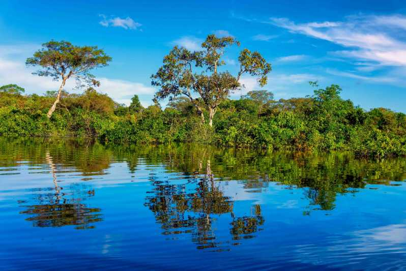
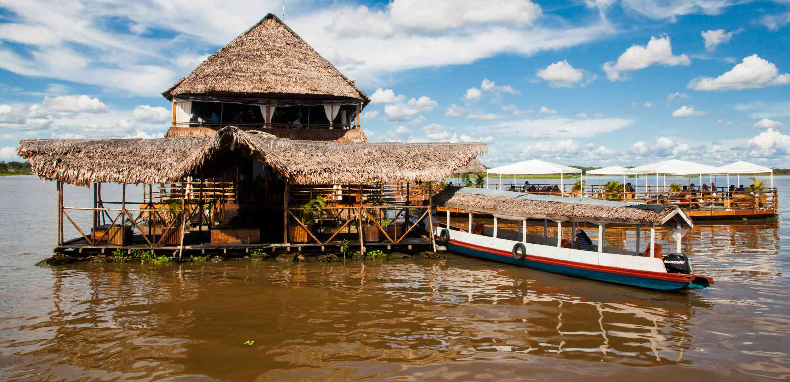

[[Back to the list]](city_list.md)
# Iquitos
**Overview:** Iquitos  is the capital city of Peru's Maynas Province and Loreto Region. It is the largest metropolis in the Peruvian Amazon, east of the Andes, as well as the ninth-most populous city in Peru. Iquitos is the largest city in the world that cannot be reached by road that is not on an island; it is only accessible by river and air.

## Trips and landscape
**Day trips:** take a look at the best day trips from the city [here](https://www.tripadvisor.com/Attractions-g294315-Activities-c63-Iquitos_Loreto_Region.html).

|  |  |
| --- | --- |
|  |  |
|  |  |
