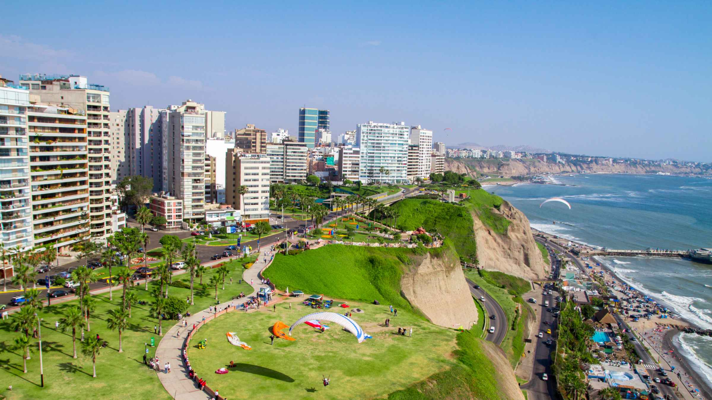
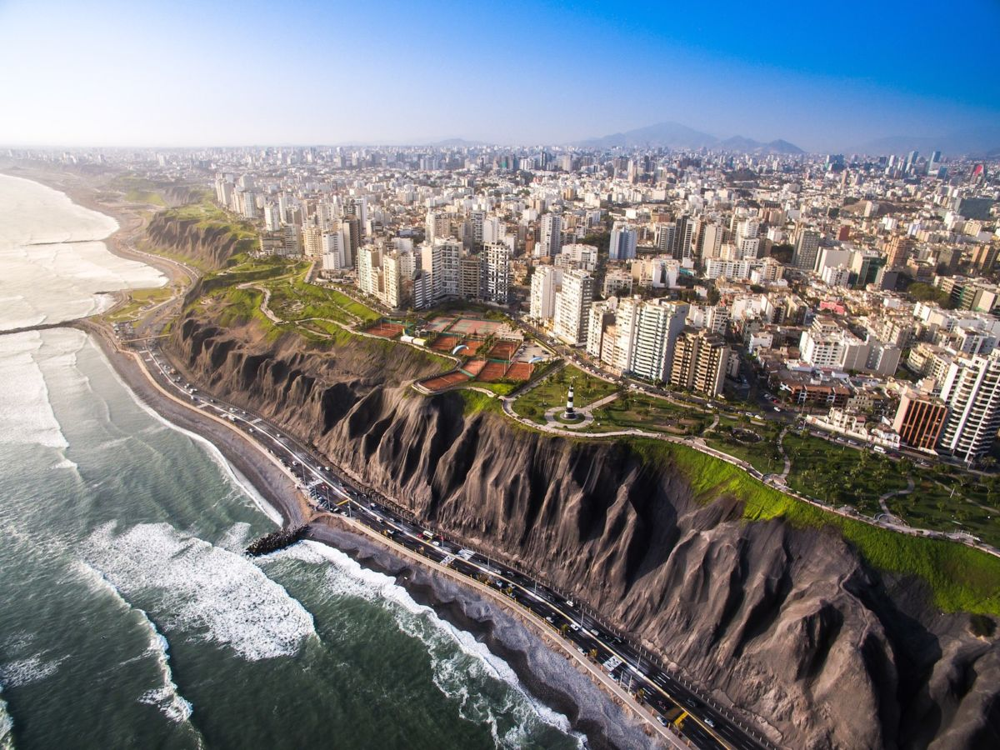
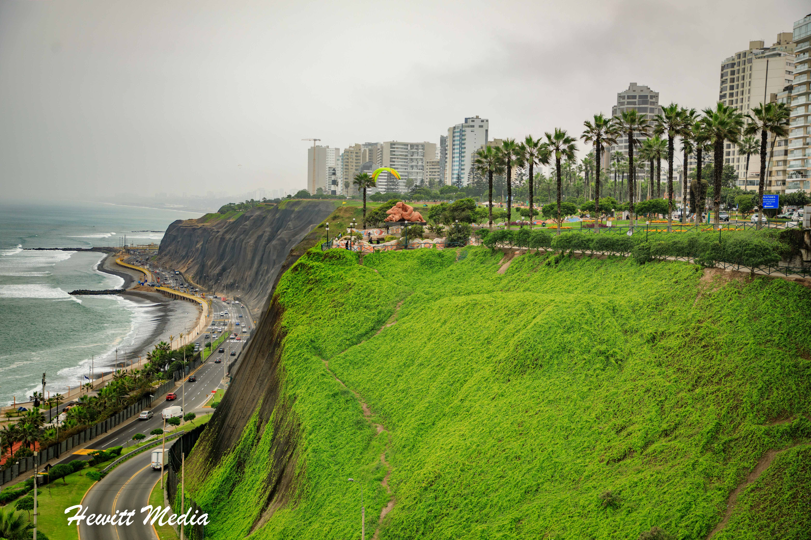
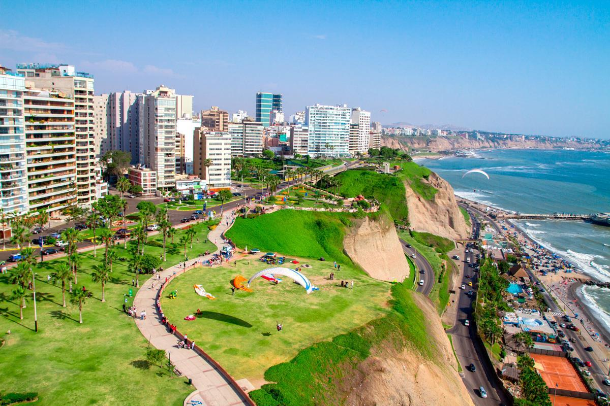
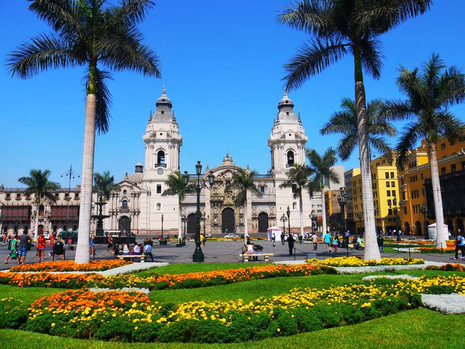

[[Back to the list]](city_list.md)
# Lima
**Overview:** Lima  is the capital and largest city of Peru. It is located in the valleys of the Chillón, Rímac and Lurín Rivers, in the desert zone of the central coastal part of the country, overlooking the Pacific Ocean. The city is considered the political, cultural, financial and commercial center of Peru. Due to its geostrategic importance, the Globalization and World Cities Research Network has categorized it as a "beta" tier city. Jurisdictionally, the metropolis extends mainly within the province of Lima and in a smaller portion, to the west, within the Constitutional Province of Callao, where the seaport and the Jorge Chávez Airport are located. Both provinces have regional autonomy since 2002.

## Trips and landscape
**Day trips:** take a look at the best day trips from the city [here](https://www.lonelyplanet.com/articles/best-day-trips-from-lima).
| title1 | titile2 |
| --- | --- |
|  |  |
|  |  |
