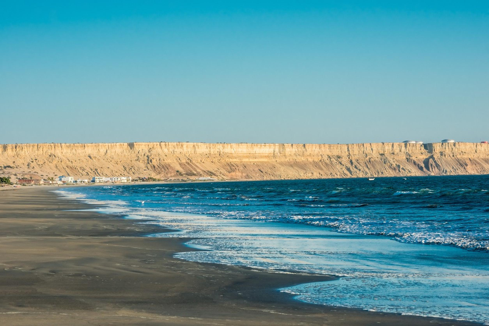

[[Back to the list]](city_list.md)
# Piura
**Overview:** Piura is a city in northwestern Peru located in the Sechura Desert on the Piura River. It is the capital of the Piura Region and the Piura Province. Its population was 484,475 as of 2017.

## Trips and landscape
**Day trips:** take a look at the best day trips from the city [here](https://www.tripadvisor.com/Attractions-g2656700-Activities-c42-Piura_Region.html).
|  |  |
| --- | --- |
|  |  |
|  |  |
