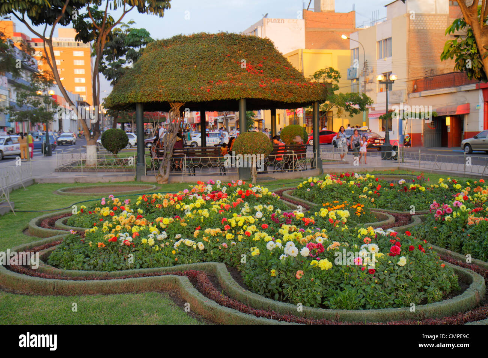
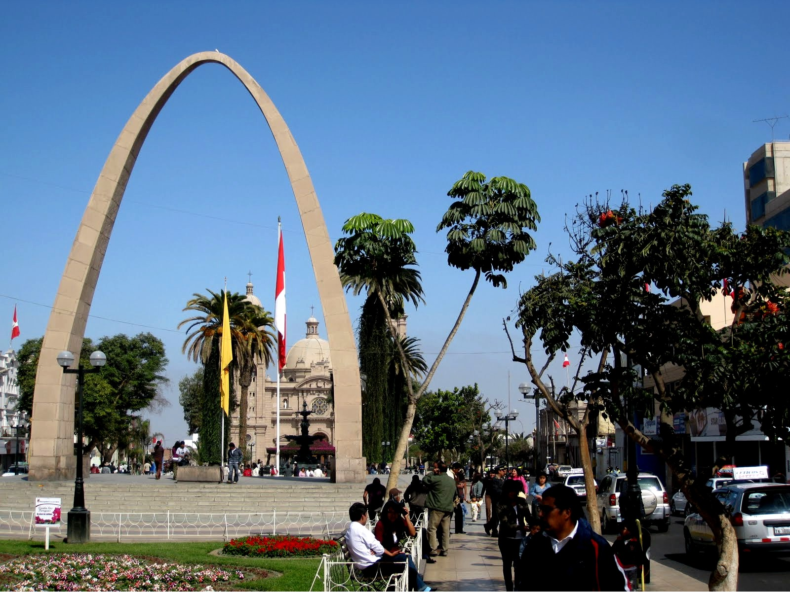
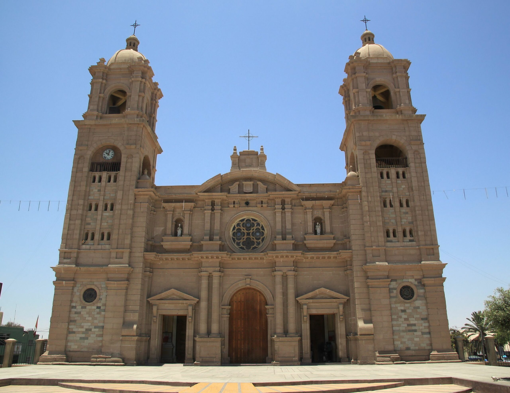
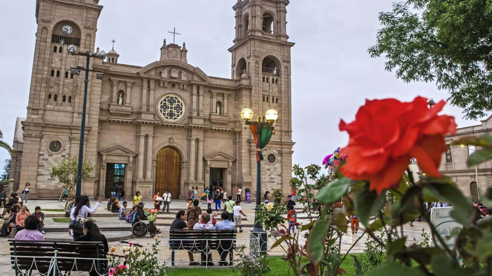

[[Back to the list]](city_list.md)
# Tacna
**Overview:** Tacna, officially known as San Pedro de Tacna, is a city in southern Peru and the regional capital of the Tacna Region. A very commercially active city, it is located only 35 km  north of the border with Arica y Parinacota Region from Chile, inland from the Pacific Ocean and in the valley of the Caplina River. It is Peru's tenth most populous city.

## Trips and landscape
**Day trips:** take a look at the best day trips from the city [here](https://www.tripadvisor.com/Attractions-g858537-Activities-c63-Tacna_Tacna_Region.html).
|  |  |
| --- | --- |
|  |  |
|  |  |
