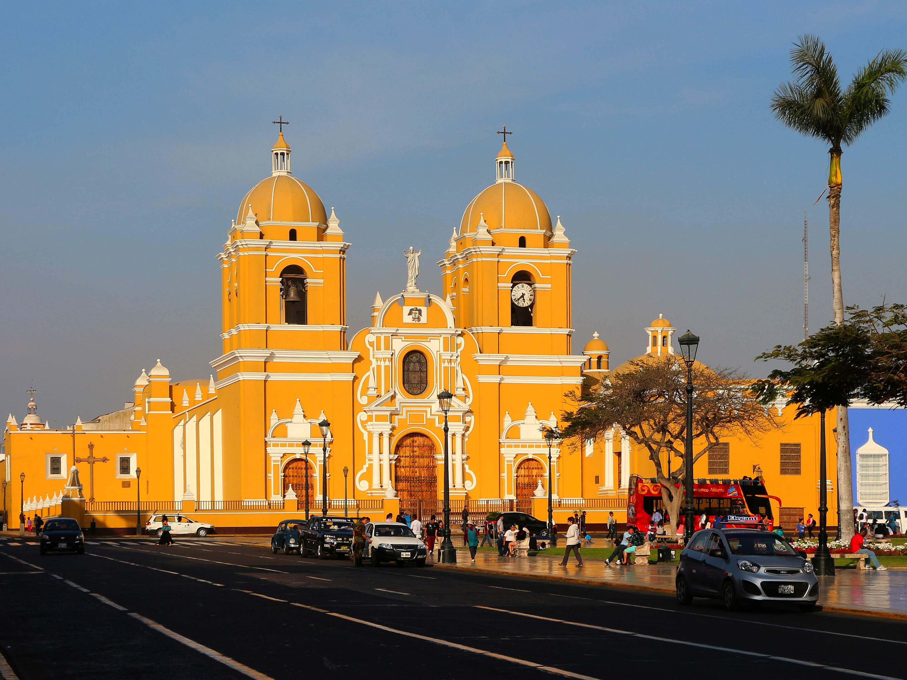

[[Back to the list]](city_list.md)
# Trujillo
**Overview:** Trujillo  is a city in coastal northwestern Peru and the capital of the Department of La Libertad. It is the third most populous city and center of the third most populous metropolitan area of Peru. It is located on the banks of the Moche River, near its mouth at the Pacific Ocean, in the Moche Valley. This was a site of the great prehistoric Moche and Chimu cultures before the Inca conquest and subsequent expansion.

## Trips and landscape
**Day trips:** take a look at the best day trips from the city [here](https://www.viator.com/Trujillo-tours/Day-Trips-and-Excursions/d5463-g5).
|  |  |
| - | - |
|  |  |
