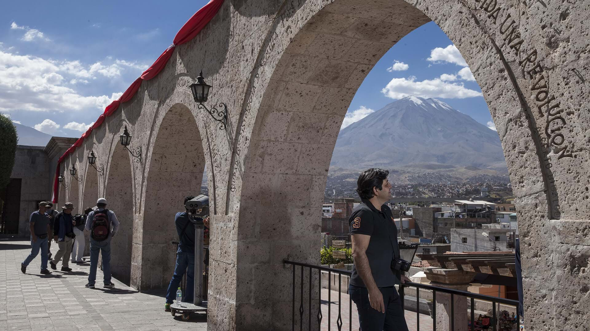
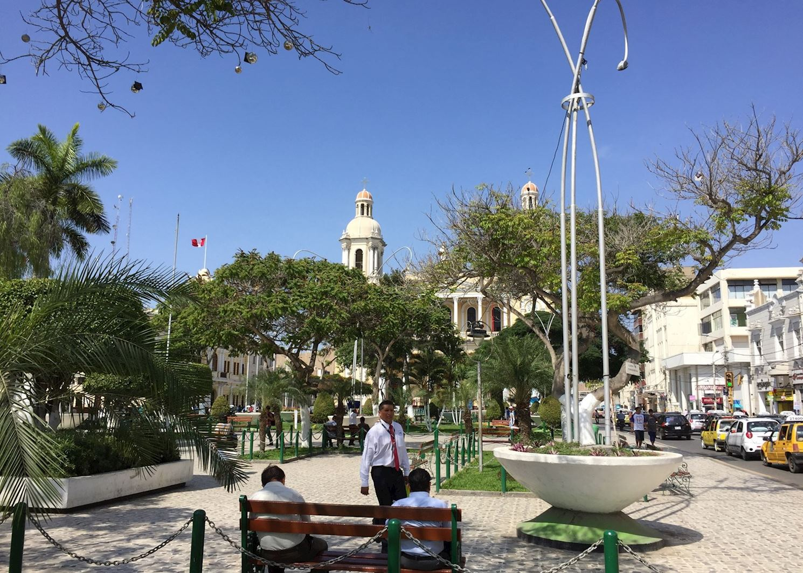
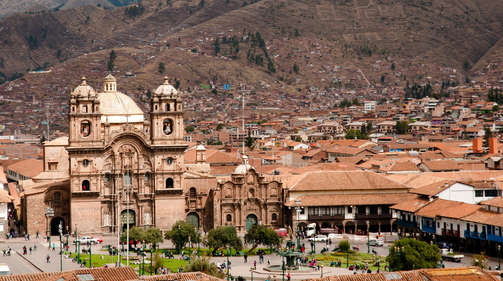
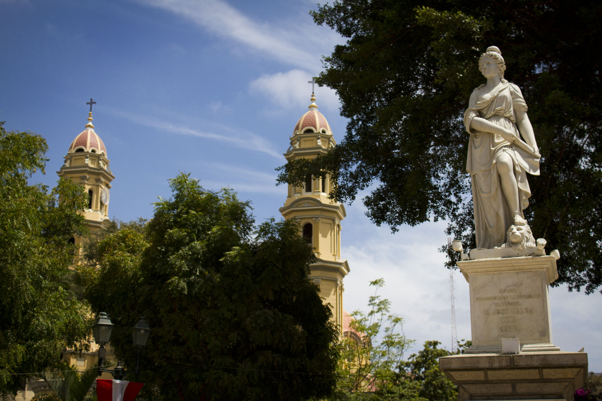
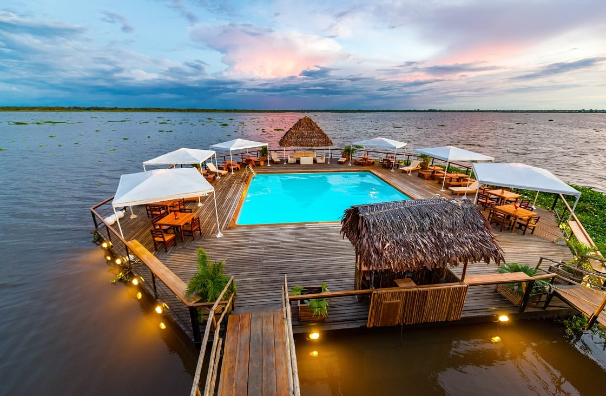
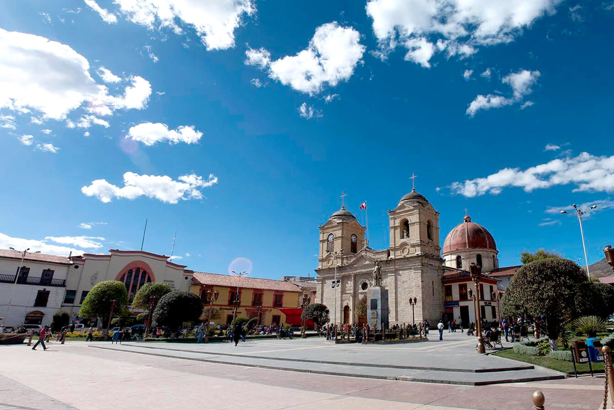
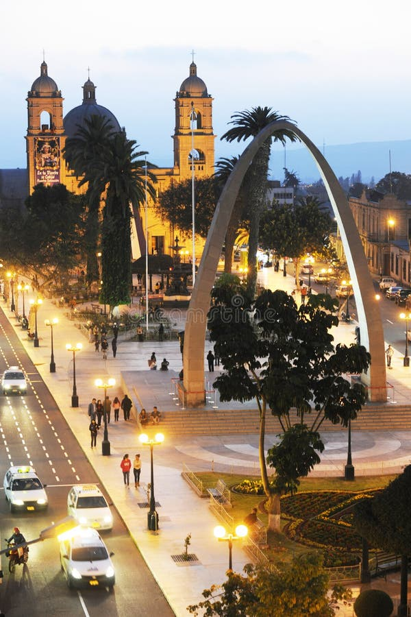

[[Back to the main page]](index.md)
## Lima
**Overview:** Lima (/ˈliːmə/ LEE-mə; Spanish pronunciation: [ˈlima]) is the capital and largest city of Peru. It is located in the valleys of the Chillón, Rímac and Lurín Rivers, in the desert zone of the central coastal part of the country, overlooking the Pacific Ocean. The city is considered the political, cultural, financial and commercial center of Peru. Due to its geostrategic importance, the Globalization and World Cities Research Network has categorized it as a "beta" tier city. Jurisdictionally, the metropolis extends mainly within the province of Lima and in a smaller portion, to the west, within the Constitutional Province of Callao, where the seaport and the Jorge Chávez Airport are located. Both provinces have regional autonomy since 2002.

[[Learn more]](Lima.md)

## Arequipa
**Overview:** Arequipa (Spanish pronunciation: [aɾeˈkipa]; Aymara and Quechua: Ariqipa) is a city in Peru and the capital of the eponymous province and department. It is the seat of the Constitutional Court of Peru and often dubbed the "legal capital of Peru".[2] It is the second most populated city in Peru, after Lima, with an urban population of 1,296,278 inhabitants according to the 2017 national census.[citation needed]

[[Learn more]](Arequipa.md)

## Trujillo
**Overview:** Trujillo (Spanish: [tɾuˈxiʝo]; Quechua: Truhillu; Mochica: Cɥimor)[12] is a city in coastal northwestern Peru and the capital of the Department of La Libertad. It is the third most populous city[13] and center of the third most populous metropolitan area of Peru. It is located on the banks of the Moche River, near its mouth at the Pacific Ocean, in the Moche Valley. This was a site of the great prehistoric Moche and Chimu cultures[14] before the Inca conquest and subsequent expansion.

[[Learn more]](Trujillo.md)

## Chiclayo
**Overview:** Chiclayo (Spanish pronunciation: [tʃiˈklaʝo]; Quechua: Chiklayu) is the principal city of the Lambayeque region in northern Peru. It is located 13 km (8.1 mi) inland from the Pacific coast and 770 km (480 mi) from the nation's capital, Lima.

[[Learn more]](Chiclayo.md)

## Cusco
**Overview:** Cusco or Cuzco[a] ([ˈkusko]; Quechua: Qusqu ([ˈqɔsqɔ]) is a city in southeastern Peru near the Urubamba Valley of the Andes mountain range. It is the capital of the Cusco Region and of the Cusco Province. The city is the seventh most populous in Peru; in 2017, it had a population of 428,450. Its elevation is around 3,400 m (11,200 ft).

[[Learn more]](Cusco.md)

## Piura
**Overview:** Piura is a city in northwestern Peru located in the Sechura Desert on the Piura River. It is the capital of the Piura Region[2] and the Piura Province. Its population was 484,475 as of 2017.

[[Learn more]](Piura.md)

## Iquitos
**Overview:** Iquitos (/ɪˈkɪtɒs, iː-, -toʊs/ ⓘ;[3][4] Spanish pronunciation: [iˈkitos]) is the capital city of Peru's Maynas Province and Loreto Region. It is the largest metropolis in the Peruvian Amazon, east of the Andes, as well as the ninth-most populous city in Peru. Iquitos is the largest city in the world that cannot be reached by road that is not on an island; it is only accessible by river and air.[5]

[[Learn more]](Iquitos.md)

## Chimbote
**Overview:** Chimbote [tʃimˈbote] ⓘ; Quechua: Chimputi) is the largest city in the Ancash Region of Peru, and the capital of both Santa Province and Chimbote District.

[[Learn more]](Chimbote.md)

## Huancayo
**Overview:** Huancayo is located in the Huancayo Province, serving as the province's capital. Situated in the Mantaro Valley at an altitude of 3,271 meters, it belongs to the Quechua region. Depending on delimitation, the agglomeration has a population between 340,000 and 380,000 and is the fifth most populous city of the country. Huancayo is the cultural and commercial center of the whole central Peruvian Andes area. Huancayo Metropolitano is made up of seven districts that form the urban center of the Junín region. This region is considered central Peru's economic and social hub.[5]

[[Learn more]](Huancayo.md)

## Tacna
**Overview:** Tacna, officially known as San Pedro de Tacna,[2][3] is a city in southern Peru and the regional capital of the Tacna Region. A very commercially active city, it is located only 35 km (22 mi) north of the border with Arica y Parinacota Region from Chile, inland from the Pacific Ocean and in the valley of the Caplina River. It is Peru's tenth most populous city.

[[Learn more]](Tacna.md)

