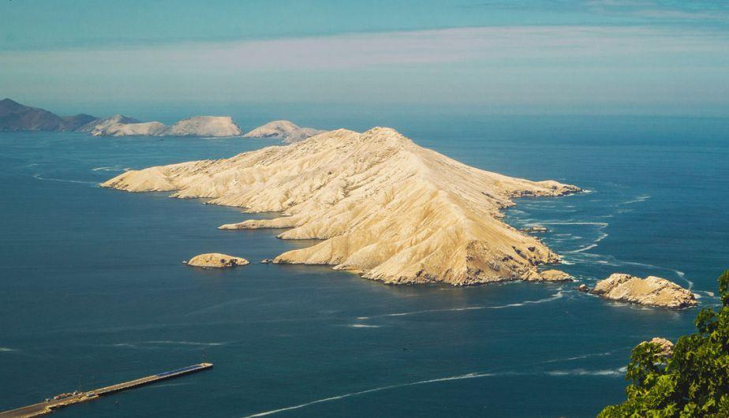

## Lima
**Population:** 11,204,382

## Arequipa
**Population:** 958,998

## Trujillo
**Population:** 903,896

## Chiclayo
**Population:** 661,935

## Cusco
**Population:** 496,968

## Piura
**Population:** 495,309

## Iquitos
**Population:** 490,882

## Chimbote
**Population:** 401,276

## Huancayo
**Population:** 400,339

## Tacna
**Population:** 337,248

