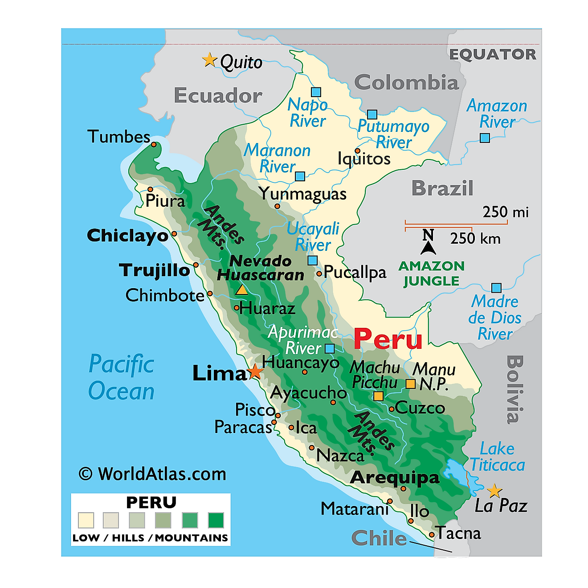

# Most notable cities of Peru

Peru is a culturally-rich country on the western coast of South America with stunning landscapes ranging from the beaches at the Pacific Ocean to the spikes of the high Andes.

[Here](city_list.md) you can find a list of its most notable cities with tourist information.